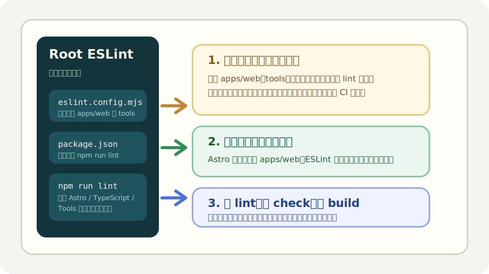

这篇文章专门记录当前仓库的 ESLint 使用方式，方便后续继续维护，也方便直接发布到站内作为统一说明文档。

它回答 4 个核心问题：

- ESLint 应该装在全局、子应用，还是仓库根目录
- 当前仓库为什么最终选择“根目录统一管理”
- 现在应该如何运行、如何修复报错、如何接入发布前检查
- 依赖分别是干什么的，后续要扩展时该从哪里下手

## 一、当前仓库为什么把 ESLint 收口到根目录

当前仓库的正式站点在 `apps/web/`，但仓库本身已经不是单纯的前端目录，它还包含：

- `tools/` 下的治理脚本
- 根目录的工程脚本和配置文件
- `tests/` 未来会继续扩展的测试资产
- `docs/` 与发布流程相关的工程治理说明

如果 ESLint 只装在 `apps/web/`：

- 它只能自然覆盖站点源码
- `tools/` 里的脚本无法顺滑纳入同一套 lint 入口
- 仓库根目录无法形成统一质量门
- 以后如果新增 `apps/admin/` 或更多子应用，还会继续分裂成多份规则

所以这次最终采用的是：

> 根目录统一持有 ESLint 依赖与配置，子应用只保留自己的业务运行依赖。



这个方式的好处是：

- 根目录统一运行 `npm run lint`
- 规则入口只有一份：`eslint.config.mjs`
- 可以同时检查 `apps/web` 和 `tools`
- 更符合这份仓库当前的“平台层 + 应用层 + 工具层”组织方式

## 二、全局安装、项目安装、根目录安装分别有什么区别

### 1. 全局安装

命令示例：

```bash
npm install -g eslint
```

优点：

- 任意目录都能直接敲 `eslint`
- 做临时检查时很方便

缺点：

- 只对当前电脑有效
- 不会自动同步给团队或 CI
- 容易出现“你电脑能跑，我电脑不能跑”的版本差异

### 2. 子应用安装

命令示例：

```bash
npm --prefix apps/web install -D eslint
```

优点：

- 离应用源码最近
- 小项目很直接

缺点：

- 规则容易被局限在子应用内部
- 不利于 lint 顶层脚本和未来的多应用结构

### 3. 仓库根目录安装

命令示例：

```bash
npm install -D eslint @eslint/js eslint-plugin-astro typescript-eslint globals
```

优点：

- 最适合 monorepo 或类 monorepo 结构
- 根目录可以统一收口脚本、CI、PR 验证
- 后续扩展到更多应用和工具目录更自然

缺点：

- 初次配置时需要更明确地写 lint 范围
- 需要思考哪些目录纳入、哪些目录忽略

对当前仓库来说，最合适的组合就是：

- 本机保留全局 `eslint`，方便日常命令行使用
- 仓库根目录保留项目内 `eslint`，保证版本一致与可复现

## 三、当前仓库已经安装了哪些依赖

根目录当前使用的依赖如下：

```json
{
  "devDependencies": {
    "@eslint/js": "^10.0.1",
    "eslint": "^10.1.0",
    "eslint-plugin-astro": "^1.6.0",
    "globals": "^17.4.0",
    "typescript-eslint": "^8.58.0"
  }
}
```

它们分别负责：

- `eslint`
  - ESLint 本体，负责执行检查
- `@eslint/js`
  - 官方基础 JavaScript 规则集
- `eslint-plugin-astro`
  - 让 ESLint 能正确理解 `.astro` 文件
- `typescript-eslint`
  - 让 ESLint 能检查 TypeScript 代码
- `globals`
  - 提供浏览器与 Node.js 环境的全局变量声明

## 四、当前仓库的配置文件放在哪里

现在 ESLint 的统一配置文件在根目录：

- `eslint.config.mjs`

这样做的目的不是“文件放哪都行”，而是明确它是 **仓库级规则入口**。

当前配置的核心思路是：

1. 忽略运行产物与依赖目录
2. 检查 `apps/web/src/` 里的 `.ts` 与 `.astro`
3. 检查 `tools/` 和根目录配置脚本
4. 同时声明浏览器与 Node.js 全局环境

示例片段如下：

```js
import js from "@eslint/js";
import astro from "eslint-plugin-astro";
import globals from "globals";
import tseslint from "typescript-eslint";

export default tseslint.config(
  {
    ignores: ["**/dist/**", "**/node_modules/**", "**/.astro/**"]
  },
  js.configs.recommended,
  ...tseslint.configs.recommended,
  ...astro.configs["flat/recommended"]
);
```

## 五、现在应该怎么使用

### 1. 运行 lint

在仓库根目录直接执行：

```bash
npm run lint
```

当前这个命令会统一检查：

- `apps/web/src/**/*.{ts,astro}`
- `tools/**/*.{js,mjs}`
- 根目录 `*.js` / `*.mjs` 配置文件

### 2. 发布前推荐顺序

当前建议的发布前最小检查顺序：

```bash
npm run lint
npm run check
npm run build
```

分别对应：

- `lint`
  - 检查代码风格、语法风险、无效转义等问题
- `check`
  - 检查更新日志、内容治理、仓库治理
- `build`
  - 实际构建 Astro 站点，确认发布产物正常

## 六、一个真实修复实例

这次接入 ESLint 时，实际扫到过一个真实问题，来自：

- `apps/web/src/lib/updateLog.ts`

原本代码里用了这样的正则：

```ts
/^###\s+(.+)\n([\s\S]*?)(?=^###\s+|\Z)/gm
```

ESLint 报错：

```text
Unnecessary escape character: \Z
```

原因是 JavaScript 正则里这里的 `\Z` 并不是必需写法，会被视为多余转义。

修复后改成：

```ts
/^###\s+(.+)\n([\s\S]*?)(?=^###\s+|$)/gm
```

这个例子很典型，它说明 ESLint 的价值不只是“格式统一”，还包括：

- 提前发现不必要或可疑写法
- 把一些隐蔽的小问题在发布前拦下来
- 给后续维护者更稳定的代码基线

## 七、常用命令示例

### 1. 检查整个仓库当前纳入范围

```bash
npm run lint
```

### 2. 只检查某个文件

```bash
npx eslint apps/web/src/lib/updateLog.ts
```

### 3. 检查某个目录

```bash
npx eslint tools
```

### 4. 使用全局 ESLint 临时检查

如果你已经全局安装：

```bash
eslint -v
eslint apps/web/src/lib/updateLog.ts
```

注意：

- 全局 `eslint` 方便临时用
- 项目内 `eslint` 负责保证仓库一致性
- 真正提交和 PR 验证时，仍然应以项目内规则为准

## 八、什么时候应该继续扩展这套规则

目前这套规则已经覆盖当前最关键的部分，但后续如果仓库继续增长，可以扩展：

- 把 `tests/` 纳入 lint
- 对 `tools/` 启用更严格的 Node.js 脚本规则
- 配合 import boundary 工具限制跨目录依赖
- 把 `npm run lint` 接入 GitHub Actions 或 PR 检查

换句话说，当前这版是：

- 已可用
- 已验证
- 适合当前仓库规模

但它不是终点，而是后续质量门建设的起点。

## 九、结论

这次 ESLint 接入最终定下来的工程口径是：

- 全局安装可以保留，用于本机任意目录快速调用
- 项目内依赖以仓库根目录为准，用于团队协作与可复现执行
- 根目录统一持有 `eslint.config.mjs` 与 `npm run lint`
- 子应用专注自己的业务依赖，不再单独维护一份 ESLint 主规则

如果后续你继续发布这类工程文章，这篇可以直接作为“仓库级 ESLint 说明”的唯一真源。
