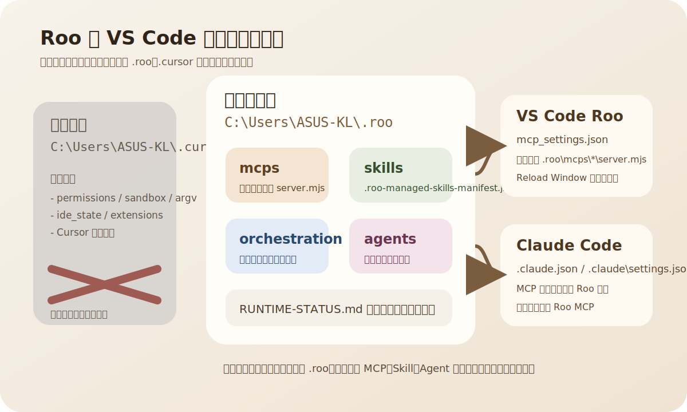
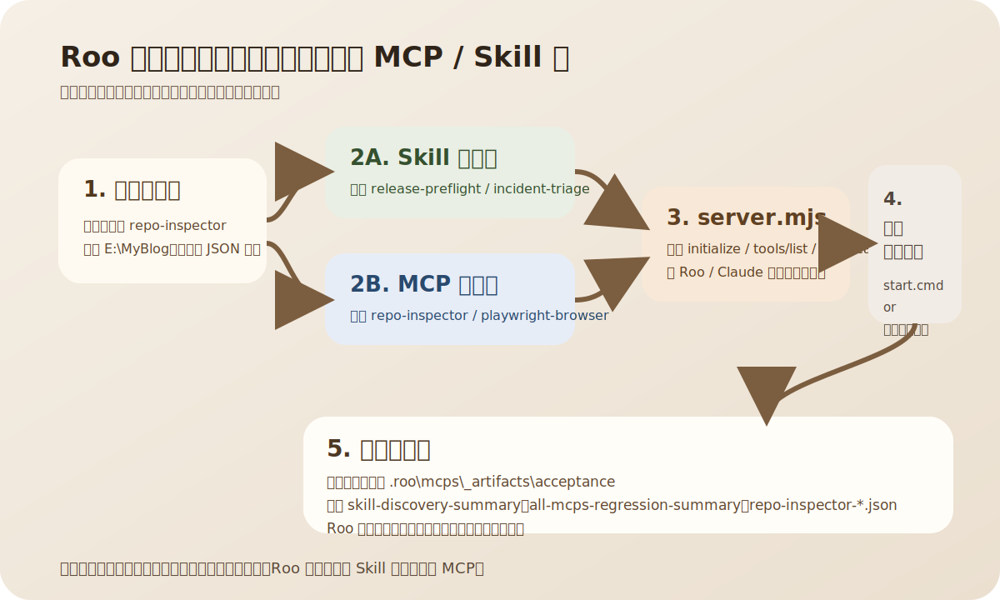

如果你手上已经有一套散落在 Cursor、VS Code、Claude、脚本目录里的 AI 工具链，真正难的往往不是“再装一个插件”，而是把它们收口成一套可以持续使用、可以验证、可以排障的运行结构。

这篇文章记录的，就是我最近做的一次完整收口：把原本带有 `.cursor` 历史包袱的能力，迁移到以 `C:\Users\ASUS-KL\.roo` 为唯一活动根目录的 Roo 体系里，再把这套能力同步给 Claude Code，让 Roo 和 Claude 在 VS Code 里看到的是同一套 MCP 入口、同一套技能目录、同一套权限策略。



*图 1：当前活动运行态以 `.roo` 为根，`.cursor` 只保留为历史归档与迁移源。*

## 这次迁移的目标到底是什么

先把目标说清楚，后面的每一项改动才不会变成“多做了一堆文件搬运”。

这次的目标一共只有四个：

1. 让 `.roo` 成为唯一活动运行根，运行时不再依赖 `.cursor`
2. 让 Roo 和 Claude 看到同一套 MCP 服务入口
3. 尽量减少确认弹窗，把权限收口到清晰、可控、可验证的配置里
4. 把“能运行”升级为“能发现、能调用、能回归验证”

换句话说，这不是一次简单复制，而是一次从“配置能凑合跑”到“运行面闭环”的整理。

## 我实际做了哪些事

这轮迁移里，真正落地的工作主要有下面几类。

### 1. 先划清活动运行态和历史归档的边界

原来用户侧有一批来自 Cursor 的文件，比如：

- `permissions.json`
- `sandbox.json`
- `argv.json`
- `ide_state.json`
- `.cursor/extensions`

这些东西并不是不能用，而是不适合直接当成 Roo 的活动运行配置。我的处理方式是：

- 先归档，避免无提示放大执行权限
- 保留 `.cursor` 作为历史参考
- 把活动运行入口全部转回 `.roo`

这一步的意义非常大。没有边界，后面每一次排障都会变成“到底是谁在生效”。

### 2. 把 `.roo` 的技能发现链路收口为 Roo 原生命名

我把托管技能清单从旧的 Cursor 命名收口到了 Roo 命名：

- `skills/.cursor-managed-skills-manifest.json`
- 改成
- `skills/.roo-managed-skills-manifest.json`

同时把相关脚本、README、技能文档、更新日志一起改掉，避免活动文档继续教人回退到旧路径。

### 3. 修正真正的 MCP 服务入口

这是这次迁移里最关键的知识点之一。

一开始 `.roo\mcps` 下面很多目录虽然叫 MCP，但它们的入口其实只是 `start.cmd` 一类的探针脚本，适合回归验证，不适合长期作为标准 stdio MCP server 被 Roo 或 Claude 挂载。

所以我做了两件事：

- 保留 `start.cmd` 继续承担 smoke/default 回归职责
- 补出真正的 `server.mjs`，让 Roo 和 Claude 连接的是标准 stdio server

其中：

- `orchestration-pipeline` 原本就有真实服务能力，我修了它的握手兼容性
- 其余探针型目录，我新增了通用骨架 `mcps/_shared/probe-server.mjs`
- 再给每个 MCP 目录补了自己的 `server.mjs`

这样 Roo/Claude 连接的是 `server.mjs`，而 `server.mjs` 再按需要调用本目录下的 `start.cmd` 进行探测与落证据。

### 4. 统一 Roo 和 Claude 的配置视图

真正的活动入口现在统一指向：

```text
C:\Users\ASUS-KL\.roo\mcps\*\server.mjs
```

我改动了三层配置：

1. Roo VS Code 全局存储里的 `mcp_settings.json`
2. Roo 备用存储里的 `mcp_settings.json`
3. Claude 侧的 `C:\Users\ASUS-KL\.claude.json`

同时，Claude 的 `C:\Users\ASUS-KL\.claude\settings.json` 也同步到了同一套权限视图，允许整套 Roo MCP 工具被直接调用。

### 5. 放宽 Claude 的权限模式，减少反复确认

为了贴近“少打扰、可直接工作”的使用习惯，这次还把 Claude 的权限模式调整到了：

```json
"defaultMode": "bypassPermissions"
```

并补上了 Roo MCP 的通配规则，比如：

```json
"mcp__repo-inspector__*"
"mcp__playwright-browser__*"
"mcp__orchestration-pipeline__*"
```

这类规则的意义不是“无限放飞”，而是把你已经明确接管的本地工具，转成稳定、可持续的默认授权。

### 6. 补了运行态真源文档

我还新增并更新了 `RUNTIME-STATUS.md`，把下面这件事写成活动运行态真源：

- 活动根目录是谁
- MCP 当前挂在哪些配置文件里
- 哪些目录是活动目录
- 哪些目录只是 archive

这能大幅减少以后“明明改了配置，结果改错地方”的概率。

## 这次迁移里最值得记住的知识点

很多人会把 Roo、MCP、Skill、Agent 混成一层。实际上，这几件事在运行语义里是分开的。

| 层级 | 作用 | 这次迁移里的典型例子 |
| --- | --- | --- |
| MCP | 工具层，负责被模型调用 | `repo-inspector`、`playwright-browser`、`orchestration-pipeline` |
| Skill | 流程层，负责把多个动作编排成一套工作流 | `release-preflight`、`incident-triage`、`module-acceptance` |
| Agent | 角色层，负责提示词与职责边界 | `pipeline-executor`、`pipeline-reviewer` |

一个很好记的区分方式是：

- **MCP 像工具箱**
- **Skill 像操作手册**
- **Agent 像岗位分工**

再往下还有三个非常实用的知识点。

### 1. `start.cmd` 不等于真正的 MCP server

如果一个目录只有：

```text
start.cmd
README.md
server.json
```

它更像“可执行探针”或“验收包装器”，不一定是标准的 stdio MCP server。

真正能被 Roo/Claude 长期挂载的，应该是一个能处理：

- `initialize`
- `tools/list`
- `tools/call`

这类 JSON-RPC 流程的标准 server。

### 2. Roo 改完 MCP 后，经常要 `Developer: Reload Window`

原因很简单：扩展宿主不是每次都即时重新扫描配置。

如果你改了：

- `mcp_settings.json`
- 技能目录
- `server.mjs`

最稳妥的做法就是在 VS Code 里执行一次：

```text
Developer: Reload Window
```

### 3. `.cursor` 不是不能留，而是不能再充当活动真源

这次我没有暴力删除 `.cursor` 全部历史内容，而是把它留在 archive 边界内。这样做有两个好处：

1. 迁移时仍可追溯旧来源
2. 活动运行面不再被旧路径污染

这比“全部删掉”更稳，也比“继续混着用”更干净。



*图 2：在 Roo 里，一次自然语言请求通常会落到 Skill 编排或 MCP 工具调用，再把证据写回 `_artifacts`。*

## 在 Roo 语境里，应该怎么实际调用这些工具和技能

很多人第一次用 Roo，会以为要自己去记内部的 JSON-RPC 或工具名。其实大多数时候，你只要把需求说清楚，Roo 就会自己决定是走 Skill 还是走 MCP。

### 一条经验：先说目的，再说对象，最后说期望输出

最好用下面这个句式：

```text
请做什么 + 针对哪个目录/仓库 + 我想要什么形式的结果
```

例如：

```text
请调用 repo-inspector 检查 E:\MyBlog，并给我一个 JSON 摘要。
```

或者：

```text
请使用 release-preflight skill，对当前仓库做一轮发布前检查，并告诉我阻塞项。
```

### 什么时候适合直接点名 MCP

如果你的目标很具体、很像一次精确探测，适合直接点名 MCP。

下面这些说法就非常适合：

| 场景 | 推荐提示词 | 预期落点 |
| --- | --- | --- |
| 仓库巡检 | 请调用 `repo-inspector` 检查 `E:\MyBlog`，返回摘要 | `repo-inspector -> run_probe` |
| 浏览器/页面探测 | 请调用 `playwright-browser` 以 default 模式检查当前仓库，并告诉我最新 artifact | `playwright-browser -> run_probe` |
| 经验读写探测 | 请调用 `experience-manager`，确认当前探针是否正常 | `experience-manager -> run_probe` |
| 一键跑流水线 | 请调用 `orchestration-pipeline` 跑一次完整流水线并总结结果 | `run_orchestration_pipeline` |
| 校验 relay | 请调用 `orchestration-pipeline` 的 relay 校验，`relayUrl` 设为某地址 | `verify_orchestration_relay` |

如果你想更稳一点，也可以把目标仓库写死在提示词里：

```text
请调用 repo-inspector，targetRepo 设为 C:\Users\ASUS-KL\.roo，并返回最新证据文件路径。
```

### 什么时候适合直接点名 Skill

如果你的目标不是一次单点探测，而是一整套流程，比如发布前检查、事故收敛、迁移边界检查，就更适合点名 Skill。

下面这些场景建议优先用 Skill：

| 场景 | 推荐提示词 | 适合原因 |
| --- | --- | --- |
| 发布前检查 | 请使用 `release-preflight` skill，对当前项目做发布前检查 | 它更像一组流程，不是一次单点工具调用 |
| 事故排障 | 请使用 `incident-triage` skill，帮我把这个异常现象收敛成排障清单 | 需要整理问题、证据和下一步建议 |
| 模块验收 | 请使用 `module-acceptance` skill，验收某个模块的入口、API 和证据链 | 更偏验收工作流 |
| 回归快照 | 请使用 `regression-snapshot` skill，帮我记录一轮回归快照 | 涉及批量证据归档 |
| 迁移清边界 | 请使用 `migration-boundary-check` skill，检查是否还残留 `.cursor` 运行依赖 | 更适合流程型扫描 |
| 跑编排流水线 | 请使用 `run-orchestration-pipeline` skill，跑一轮并告诉我卡点 | 比直接工具调用更接近使用者语言 |

### 你现在这套 Roo 里，最值得优先记住的 MCP

当前已经挂好的 11 个 MCP 里，最常用的其实是下面这几个：

- `repo-inspector`：看仓库是否干净、是否具备基本结构
- `playwright-browser`：看页面或浏览器探针是否能跑通
- `experience-manager`：看经验读写链路是否正常
- `orchestration-pipeline`：跑真正的编排流水线
- `log-diagnose`：适合后续扩展日志诊断
- `prompt-compressor` / `context-reranker` / `context-store`：偏上下文处理能力

### 你现在这套 Roo 里，最值得优先记住的 Skill

当前这批技能里，最建议优先使用的是：

- `release-preflight`
- `incident-triage`
- `module-acceptance`
- `migration-boundary-check`
- `regression-snapshot`
- `run-orchestration-pipeline`
- `gateway-restart-safe`

至于 `create-rule`、`migrate-to-skills`、`update-cursor-settings` 这类技能，现在更适合被看作兼容层或迁移层，不建议拿来做日常主流程。

## 这套东西现在怎么判断“真的能用”

我不太信“看起来已经配好了”。真正可靠的标准，应该是能不能被发现、能不能列工具、能不能实际调用。

这次迁移完成后，验证结果是这样的：

### 1. Claude 侧 MCP 健康检查

```text
11 个 MCP 全部显示 ✓ Connected
```

### 2. 技能发现检查

```text
managedCount=7
passCount=7
failCount=0
status=ok
```

### 3. 全 MCP 回归

```text
smokePass=11
defaultPass=10
failedCount=0
status=ok
```

### 4. 工具面验证

我还逐个对这些 server 跑了 `tools/list`：

- 10 个探针型 MCP 都能列出 `run_probe`
- `orchestration-pipeline` 能列出：
  - `run_orchestration_pipeline`
  - `verify_orchestration_relay`

这说明它们不是“只挂了配置”，而是真的已经形成了可调用的工具面。

## 如果你后面还要继续扩展 Roo，这几条最重要

这次做完以后，我觉得最值得长期保留的经验有五条。

1. 新增 MCP 时，优先补真正的 `server.mjs`，不要只停留在 `start.cmd`
2. 活动运行面统一以 `.roo` 为根，不要让 `.cursor` 回流成活动依赖
3. Roo 改完 MCP 或技能目录后，记得 `Developer: Reload Window`
4. 如果你希望 Claude 也共享同一套能力，记得同步 `.claude.json` 和 `.claude/settings.json`
5. `RUNTIME-STATUS.md` 这类运行态真源文档要持续维护，不然过几周又会失真

## 结语

从结果上看，这次迁移真正完成的，不只是“把文件挪进了 `.roo`”，而是把一套原本分散、带历史包袱的 AI 工具链，收口成了一套更像产品、也更像工程系统的结构：

- 运行根清晰
- 工具入口统一
- 技能层与工具层分工明确
- Claude 与 Roo 视图一致
- 回归验证和证据归档都能闭环

如果你也正在把 Cursor、Roo、Claude、MCP、技能目录揉成一套自己的本地 AI 工具链，我的建议只有一句：

> 先建立活动运行态真源，再谈扩展能力；先让它可验证，再让它看起来完整。

这样你后面每加一个 MCP、每加一个 Skill、每加一层代理能力，都会轻松很多。
